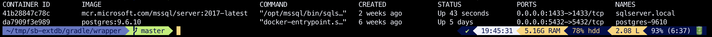

# Service Builder - External Database
[](https://www.dontesta.it)
[](https://travis-ci.org/amusarra/liferay-72-soap-client-examples)
[](https://twitter.com/antonio_musarra)

An example of a Service Builder project for Liferay 7.2 Community Edition/DXP that uses an external data source.

This project is a fork of the [sb-extdb](https://github.com/dnebing/sb-extdb) project realized by [David H Nebinger](https://liferay.dev/web/guest/profile/-/user/user.26526). You can see the blog post for more info: [Liferay 7 - Service Builder and External Databases](https://liferay.dev/blogs/-/blogs/liferay-7-service-builder-and-external-databases)

This fork has been updated to support Liferay 7.2. For more information, I invite you to read this documentation. [Connecting Service Builder to External Databases](https://portal.liferay.dev/docs/7-1/tutorials/-/knowledge_base/t/connecting-service-builder-to-external-databases#step-2-create-a-spring-bean-that-points-to-the-data-source)

**Warning!** Since version 7.2 a little bit has changed. There are two different ways to create the connection:

1. **DataSourceProvider:** This approach involves implementing a [`DataSourceProvider`](https://docs.liferay.com/ce/portal/7.2-latest/javadocs/portal-kernel/com/liferay/portal/kernel/dao/jdbc/DataSourceProvider.html) [`ServiceProviderInterface`](https://docs.oracle.com/javase/tutorial/sound/SPI-intro.html) (SPI). This way requires the fewest files and steps and works regardless of whether your Service Builder module uses the `ds` or `spring` [dependency injector](https://portal.liferay.dev/docs/7-2/appdev/-/knowledge_base/a/defining-global-service-information#dependency-injector);
2. **Spring Beans:** Configure the connection using Spring XML files. This approach only works with Service Builder modules that use the `spring` [dependency injection option](https://portal.liferay.dev/docs/7-2/appdev/-/knowledge_base/a/defining-global-service-information#dependency-injector).

This project uses the second option, the one via Spring Beans.

For this reason I invite you to read these two documents:

1. [Connecting the Data Source Using a DataSourceProvider](https://portal.liferay.dev/docs/7-2/appdev/-/knowledge_base/a/connecting-the-data-source-using-a-datasourceprovider)
2. [Connecting the Data Source Using Spring Beans](https://portal.liferay.dev/docs/7-2/appdev/-/knowledge_base/a/connecting-the-data-source-using-spring-beans)

In this documentation, I show the case that the Liferay database is PostgreSQL, while the external Microsoft SQL Server database.


## 1. Quick Start

The external entity to which we want to access from Liferay has the following structure.

| Attribute                        | Primary | Type     | Description                                                  |
| -------------------------------- | :-----: | -------- | ------------------------------------------------------------ |
| **UUID**                         |    X    | String   | Universal Unique Identifier of the Liferay User              |
| **Screen Name**                  |         | String   | The Liferay user Screen Name                                 |
| **System Name**                  |         | String   | IP Address, Hostname, Virtual Host or FQDN of the Liferay instance |
| **Last Login**                   |         | Datetime | We'll track the date of last login                           |
| **Total Login**                  |         | Long     | We'll track the total number of individual logins for the user |
| **Shortest Time Between Logins** |         | Long     | And we'll also track the shortest time between logins        |
| **Longest Time Between Logins**  |         | Long     | Let's also track the longest time between logins             |


The SQL code below shows the creation of the ExtDB_UserLogin table on the external db, in this case SQL Server.

```mssql
create table ExtDB_UserLogin
(
    uuid_ VARCHAR(75) not null primary key,
    screenName VARCHAR(75) null,
    systemName VARCHAR(75) null,
    lastLogin DATETIME null,
    totalLogins BIGINT,
    longestTimeBetweenLogins BIGINT,
    shortestTimeBetweenLogins BIGINT
);
```


The table shows the modules of the project is their purpose.

| Module                 | Type             | Description                                                  |
| ---------------------- | ---------------- | ------------------------------------------------------------ |
| **sb-extdb-api**       | Service Builder  | API module for the external database table                   |
| **sb-extdb-service**   | Service Builder  | Service implementation for the external database table       |
| **sb-extdb-postlogin** | Lifecycle Action | Post login action for the tracking the login information into the external database table |


The [service.xml](https://github.com/amusarra/sb-extdb/blob/master/sb-extdb-service/service.xml) file shows the definition of the **UserLogin** entity that mirrors the external database table.

```xml
<?xml version="1.0"?>
<!DOCTYPE service-builder PUBLIC "-//Liferay//DTD Service Builder 7.2.0//EN"
		"http://www.liferay.com/dtd/liferay-service-builder_7_2_0.dtd">

<service-builder dependency-injector="spring" package-path="com.liferay.example.servicebuilder.extdb">

	<!-- Define a namespace for our example -->
	<namespace>ExtDB</namespace>

	<!-- Define an entity for tracking login information. -->
	<entity
		cache-enabled="false"
		data-source="extDataSource"
		local-service="true"
		name="UserLogin"
		remote-service="false"
		uuid="false"
	>
		<!-- session-factory="extSessionFactory" tx-manager="extTransactionManager" -->

		<!-- uuid of the user model is our primary key. -->
		<column name="uuid" primary="true" type="String" />

		<!-- screenName of the user model is our primary key. -->
		<column name="screenName" type="String" />

		<!-- SystemName of the user model is our primary key. -->
		<column name="systemName" type="String" />

		<!-- We'll track the date of last login -->
		<column name="lastLogin" type="Date" />

		<!-- We'll track the total number of individual logins for the user -->
		<column name="totalLogins" type="long" />

		<!-- Let's also track the longest time between logins -->
		<column name="longestTimeBetweenLogins" type="long" />

		<!-- And we'll also track the shortest time between logins -->
		<column name="shortestTimeBetweenLogins" type="long" />
	</entity>
</service-builder>
```


Below the configuration (portal-ext.properties) of the PostgreSQL database used by Liferay, while the external database is SQL Server.

```properties
    #
    # PostgreSQL
    #
    jdbc.default.driverClassName=org.postgresql.Driver
    jdbc.default.url=jdbc:postgresql://localhost:5432/lportal_713_ce_ga4_develop
    jdbc.default.username=liferay
    jdbc.default.password=liferay

    #
    # SQL Server 2017 as External DB
    #
    jdbc.ext.driverClassName=com.microsoft.sqlserver.jdbc.SQLServerDriver
    jdbc.ext.url=jdbc:sqlserver://localhost;databaseName=lportal_dev_external_db
    jdbc.ext.username=liferay
    jdbc.ext.password=lportal@DEV@72
```


For the Liferay and external databases, I used two docker containers, one for PostgreSQL and one for SQL Server.



Refer to the [liferay-portal-database-all-in-one-support](https://github.com/amusarra/liferay-portal-database-all-in-one-support) project to add SQL Server support to Liferay. For the JDBC driver to use refer to the documentation of the specific database server.

The instructions below show the clone of the project, build and deploy on your Liferay instance 7.1. I always recommend checking from the [compatibility matrix](https://web.liferay.com/it/services/support/compatibility-matrix) which databases are supported by Liferay.

Replace the `$LIFERAY_HOME` with your Liferay Home direcory.

```bash
$ git clone https://github.com/amusarra/sb-extdb
$ cd sb-extdb
$ ./gradlew clean deploy -Pauto.deploy.dir=$LIFERAY_HOME/deploy
```


Once the three modules have been deployed, if you try to log in to Liferay, the login action will be stored on the external database.

```shell
g! lb SB
START LEVEL 20
   ID|State      |Level|Name
 1014|Active     |   10|SB External DB API (1.0.0)|1.0.0
 1015|Active     |   10|SB External DB Post Login Hook (1.0.0)|1.0.0
 1016|Active     |   10|SB External DB Service (1.0.0)|1.0.0
```


The figure below shows the data entered in the external table from the post login hook.


The following readings may be useful:

1. [Liferay 7 CE: How to add support for SQL Server DB](https://www.dontesta.it/en/2016/04/19/liferay-7-ce-how-to-add-support-for-sql-server-db/)
2. [How to setup Docker container SQL Server 2017 for Liferay Development Environment](http://bit.ly/2oCgGUp)
3. [How to build a Docker Liferay 7.2 image with the SQL Server 2017 Database support](http://bit.ly/2MhyFHV)
4. [How to setup Docker container Oracle Database 12c for Liferay Development Environment](http://bit.ly/2zn7R2U)
5. [How to build a Docker Liferay 7.2 image with the Oracle Database support](http://bit.ly/2TOki0Q)

